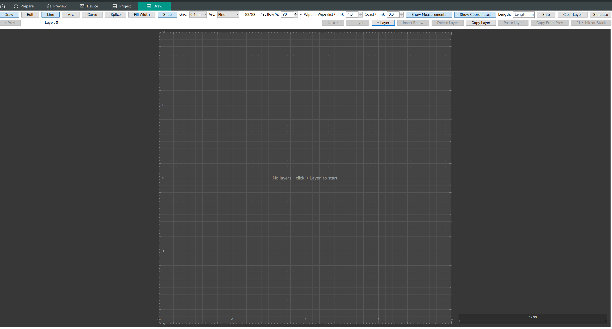

# OrcaSlicer — Draw Mode

> **This is a fork of [OrcaSlicer](https://github.com/OrcaSlicer/OrcaSlicer) containing a feature I designed and built: _Draw Mode_.**
> It is not yet upstreamed. Everything below the divider is the original upstream README.
> — [@raddy100](https://github.com/raddy100)

Draw Mode bypasses the CAD → mesh → slice pipeline entirely and lets you author printer
toolpaths **by hand**, on a 2D canvas, and emit real machine-ready G-code from them.

Think of the existing G-code Preview, except instead of *viewing* paths the slicer produced,
you *draw* the paths yourself. There is no model, no mesh, and no slicing step — you draw
lines, arcs, and Bézier curves on a top-down view of the build plate, and those strokes
become extrusion moves. It targets cases where you want explicit control over head motion:
experimental single-wall structures, extrusion art, and calibration sequences.

All print parameters — temperature, speed, nozzle diameter, retraction, fan, flavor, start/end
G-code — are read from the active printer/filament/process presets, so Draw Mode never
duplicates OrcaSlicer's settings UI. You author geometry; the profile supplies the physics.



## What it does

- **Draw straight lines, circular arcs, and cubic Béziers** with multi-click input and
  draggable control handles. Curves are sampled to a configurable chord tolerance, or emitted
  as **native `G2`/`G3`** arcs when the firmware supports them.
- **Full undo/redo** over every edit, via a command stack — 14 command types covering segment
  add/delete/translate, endpoint and control-handle drags, connected-endpoint moves, layer
  insert/remove/clear, copy/paste, splice, and a Z-mirror of the whole stack.
- **Layer-stack editing** — insert above/below, copy a layer, paste additively, copy from
  previous, mirror the stack, and remove layers with automatic Z-reflow of everything above.
- **Print-quality correctness built into the generator**, not bolted on afterwards:
  anti-blob wipe along the just-printed path before each retract, optional coasting,
  per-layer elephant's-foot flow reduction, and a fan ramp matching upstream's `CoolingBuffer`.
- **Round-trips through `.3mf`** — sessions persist inside the project file, and drawn paths
  become placeable objects that copy/paste on the plate and print sequentially.

## Where the code lives

The feature is split so the model and the G-code generator carry no GUI dependency and stay
unit-testable on their own.

| Layer | Files | Responsibility |
|---|---|---|
| Core model | `src/libslic3r/DrawSession.{hpp,cpp}` | Pure-data session: layers, segments, Z-reflow. No wx, no GUI. |
| G-code | `src/libslic3r/DrawPathGCodeGenerator.{hpp,cpp}` | Session → machine-ready G-code via the existing `GCodeWriter`. |
| Geometry | `src/libslic3r/DrawPathMesh.{hpp,cpp}`, `DrawModeFeedback.{hpp,cpp}` | Synthetic mesh for the plate; curve sampling and length feedback. |
| Commands | `src/slic3r/GUI/DrawModeCommands.{hpp,cpp}` | Undo/redo command objects. Header-only where it aids testability. |
| UI | `src/slic3r/GUI/DrawModePanel`, `DrawModeInputHandler`, `DrawLayerSlider` | Panel, hit-testing and input routing, layer slider. |
| Tests | `tests/libslic3r/test_draw_layer_slider.cpp`, `tests/fff_print/test_gcodewriter.cpp` | Catch2 coverage for slider mapping and writer behavior. |

## Design notes

A few decisions worth calling out, since they shaped the rest of the feature:

- **The session stores geometry, never settings.** Temperature and speed are read fresh from
  the active config at generation time, so changing a profile never invalidates a drawing.
  Layer *heights* are the deliberate exception — they're snapshotted per layer, with
  `base_layer_heights` kept separately so initial-layer overrides can be edited repeatedly
  without permanently baking earlier values into untouched layers.
- **`DrawSegment` stayed a backward-compatible aggregate.** Arcs and Béziers were added after
  the initial line-only implementation; the struct gained `type`/`ctrl1`/`ctrl2` with defaults
  so every previously serialized session still loads, and existing construction sites still
  compile untouched.
- **Wipe changes where retraction happens, not how much.** The nozzle retracts backward along
  the path it just printed so end-of-path pressure bleeds out over the toolpath instead of
  forming a blob at the seam. Net retraction length is identical to a plain retract.
- **Batch generation shares one preamble.** Multi-instance plates emit a single homing
  sequence rather than one per instance.

## Building

Build instructions are unchanged from upstream — see the original README below and the
[upstream wiki](https://github.com/OrcaSlicer/OrcaSlicer/wiki).

## Further reading

- [`User_Architecture_Documents/PRD_Architecture_DrawMode.md`](User_Architecture_Documents/PRD_Architecture_DrawMode.md) —
  the full requirements and architecture document the feature was built against.
- [`docs/draw_mode_gui_redesign/`](docs/draw_mode_gui_redesign/) — implementation, testing, and
  coordination notes for the GUI redesign pass.

---

<div align="center">

<picture>
  
</picture>

<a href="https://trendshift.io/repositories/15552" target="_blank"></a>

[](https://github.com/OrcaSlicer/OrcaSlicer/stargazers) [](https://github.com/OrcaSlicer/OrcaSlicer/actions/workflows/build_all.yml)

OrcaSlicer: an open source Next-Gen Slicing Software for Precision 3D Prints.  
Optimize your prints with ultra-fast slicing, intelligent support generation, and seamless printer compatibility—engineered for perfection.
<h3>

# Official links and community

#### Official Website:
<a href="https://www.orcaslicer.com/" style="font-size:2em;">OrcaSlicer.com</a>

#### Github Repository:
<a href="https://github.com/OrcaSlicer/OrcaSlicer"> </a>

#### Follow us:
<a href="https://twitter.com/real_OrcaSlicer"> </a>

#### Join our Discord community:
<a href="https://discord.gg/P4VE9UY9gJ"> </a>

<table border="2" style="border-color: #ffa500; background-color:rgb(232, 220, 180); color: #856404;">
<tr>
<td>
<strong>⚠️ CAUTION:</strong><br>
Several clickbait and malicious websites, such as <b>orca-slicer[.]com</b> and <b>orcaslicer[.]net</b>, are pretending to be the official OrcaSlicer site. These sites may redirect you to dangerous downloads or contain misleading information.<br>
<b>Our only official website is <a href="https://www.orcaslicer.com/">www.orcaslicer.com</a>.</b><br><br>
If you come across any of these in search results, please <b>report them</b> as unsafe or phishing to help keep the community secure with:<br>
 - <a href="https://safebrowsing.google.com/safebrowsing/report_phish/">Google Safe Browsing</a><br>
 - <a href="https://www.microsoft.com/en-us/wdsi/support/report-unsafe-site">Microsoft Security Intelligence</a><br>
 - <a href="https://ipthreat.net/tools/reportphishing">IPThreat</a>
</td>
</tr>
</table>

</div>

# Main features

- **[Advanced Calibration Tools](https://www.orcaslicer.com/wiki/calibration_guide)**  
  Comprehensive suite: temperature towers, flow rate, retraction & more for optimal performance.
- **[Precise Wall](https://www.orcaslicer.com/wiki/quality_settings_precision#precise-wall) and [Seam Control](https://www.orcaslicer.com/wiki/quality_settings_seam)**  
  Adjust outer wall spacing and apply scarf seams to enhance print accuracy.
- **[Sandwich Mode](https://www.orcaslicer.com/wiki/quality_settings_wall_and_surfaces#innerouterinner) and [Polyholes](https://www.orcaslicer.com/wiki/quality_settings_precision#polyholes) Support**  
  Use varied infill [patterns](https://www.orcaslicer.com/wiki/strength_settings_patterns) and accurate hole shapes for improved clarity.
- **[Overhang](https://www.orcaslicer.com/wiki/quality_settings_overhangs) and [Support Optimization](https://www.orcaslicer.com/wiki#support-settings)**  
  Modify geometry for printable overhangs with precise support placement.
- **[Granular Controls and Customization](https://www.orcaslicer.com/wiki#process-settings)**  
  Fine-tune print speed, layer height, pressure, and temperature with precision.
- **Network Printer Support**  
  Seamless integration with Klipper, PrusaLink, and OctoPrint for remote control.
- **[Mouse Ear Brims](https://www.orcaslicer.com/wiki/others_settings_brim) & [Adaptive Bed Mesh](https://www.orcaslicer.com/wiki/printer_basic_information_adaptive_bed_mesh)**  
  Automatic brims and adaptive mesh calibration ensure consistent adhesion.
- **User-Friendly Interface**  
  Intuitive drag-and-drop design with pre-made profiles for popular printers.
- **[Open-Source](https://github.com/OrcaSlicer/OrcaSlicer) & [Community Driven](https://discord.gg/P4VE9UY9gJ)**  
  Regular updates fueled by continuous community contributions.
- **Wide Printer Compatibility**  
  Supports a broad range of printers: Bambu Lab, Prusa, Creality, Voron, and more.
- Additional features can be found in the [change notes](https://github.com/OrcaSlicer/OrcaSlicer/releases/).

# Wiki

The [wiki](https://www.orcaslicer.com/wiki) aims to provide a detailed explanation of the slicer settings, including how to maximize their use and how to calibrate and set up your printer.

- **[Access the wiki here](https://www.orcaslicer.com/wiki)**
- **[Contribute to the wiki](https://www.orcaslicer.com/wiki/how_to_wiki)**

# Download

## Stable Release

📥 **[Download the Latest Stable Release](https://github.com/OrcaSlicer/OrcaSlicer/releases/latest)**  
Visit our GitHub Releases page for the latest stable version of OrcaSlicer, recommended for most users.

## Nightly Builds

🌙 **[Download the Latest Nightly Build](https://github.com/OrcaSlicer/OrcaSlicer/releases/tag/nightly-builds)**  
Explore the latest developments in OrcaSlicer with our nightly builds. Feedback on these versions is highly appreciated.

# How to install

## Windows

Download the **Windows Installer exe**  for your preferred version from the [releases page](https://github.com/OrcaSlicer/OrcaSlicer/releases).

 - *For convenience there is also a portable build available.*
    <details>
    <summary>Troubleshooting</summary>

    - *If you have troubles to run the build, you might need to install following runtimes:*
    - [MicrosoftEdgeWebView2RuntimeInstallerX64](https://github.com/OrcaSlicer/OrcaSlicer/releases/download/v1.0.10-sf2/MicrosoftEdgeWebView2RuntimeInstallerX64.exe)
        - [Details of this runtime](https://aka.ms/webview2)
        - [Alternative Download Link Hosted by Microsoft](https://go.microsoft.com/fwlink/p/?LinkId=2124703)
    - [vcredist2019_x64](https://github.com/OrcaSlicer/OrcaSlicer/releases/download/v1.0.10-sf2/vcredist2019_x64.exe)
        -  [Alternative Download Link Hosted by Microsoft](https://aka.ms/vs/17/release/vc_redist.x64.exe)
        -  This file may already be available on your computer if you've installed visual studio.  Check the following location: `%VCINSTALLDIR%Redist\MSVC\v142`
    </details>

Windows Package Manager

```shell
winget install --id=SoftFever.OrcaSlicer -e
```

## Mac

1. Download the DMG for your computer: `arm64` version for Apple Silicon and `x86_64` for Intel CPU.
2. Drag OrcaSlicer.app to Application folder.
3. *If you want to run a build from a PR, you also need to follow the instructions below:*

    <details>
    <summary>Quarantine</summary>

    - Option 1 (You only need to do this once. After that the app can be opened normally.):
      - Step 1: Hold _cmd_ and right click the app, from the context menu choose **Open**.
      - Step 2: A warning window will pop up, click _Open_

    - Option 2:
      Execute this command in terminal:

      ```shell
      xattr -dr com.apple.quarantine /Applications/OrcaSlicer.app
      ```

    - Option 3:
        - Step 1: open the app, a warning window will pop up  
            
        - Step 2: in `System Settings` -> `Privacy & Security`, click `Open Anyway`:  
            
    </details>

## Linux         

### Flathub (Recommended)
OrcaSlicer is available through FlatHub:

<a href='https://flathub.org/apps/com.orcaslicer.OrcaSlicer'></a>

Install from the command line:

```shell
flatpak install flathub com.orcaslicer.OrcaSlicer
flatpak run com.orcaslicer.OrcaSlicer
```

It can also be installed through graphical software managers (KDE Discover, GNOME Software, etc.) when Flathub is enabled. Search for **OrcaSlicer** in your software center.

### AppImage
 1. Download App image from the [releases page](https://github.com/OrcaSlicer/OrcaSlicer/releases).
 2. Double click the downloaded file to run it.

 3. If you run into trouble executing it, try this command in the terminal:
    `chmod +x /path_to_appimage/OrcaSlicer_Linux.AppImage`

# How to Compile

All updated build instructions for Windows, macOS, and Linux are now available on the official [OrcaSlicer Wiki - How to build](https://www.orcaslicer.com/wiki/how_to_build) page.

Please refer to the wiki to ensure you're following the latest and most accurate steps for your platform.

# Klipper Note

If you're running Klipper, it's recommended to add the following configuration to your `printer.cfg` file.

```gcode
# Enable object exclusion
[exclude_object]

# Enable arcs support
[gcode_arcs]
resolution: 0.1
```

# Supports

**OrcaSlicer** is an open-source project and I'm deeply grateful to all my sponsors and backers.  
Their generous support enables me to purchase filaments and other essential 3D printing materials for the project.  
Thank you! :)

## Sponsors:

<table>
<tr>
<td>
<a href="https://qidi3d.com/" style="display:inline-block; border-radius:8px; background:#fff;">
  
</a>
</td>
<td>
<a href="https://bigtree-tech.com/" style="display:inline-block; border-radius:8px; background:#222;">
    
</a>
</td>
</tr>
</table>

## Backers:

**Ko-fi supporters** ☕: [Backers list](https://github.com/user-attachments/files/16147016/Supporters_638561417699952499.csv)

## Support me

<a href="https://github.com/sponsors/SoftFever"></a>
<a href="https://ko-fi.com/G2G5IP3CP"></a>
<a href="https://paypal.me/softfever3d"></a>

## Some Background

Open-source slicing has always been built on a tradition of collaboration and attribution. [Slic3r](https://github.com/Slic3r/Slic3r), created by Alessandro Ranellucci and the RepRap community, laid the foundation. [PrusaSlicer](https://github.com/prusa3d/PrusaSlicer) by Prusa Research built on Slic3r and acknowledged that heritage. [Bambu Studio](https://github.com/bambulab/BambuStudio) in turn forked from PrusaSlicer, and [SuperSlicer](https://github.com/supermerill/SuperSlicer) by @supermerill extended PrusaSlicer with community-driven enhancements. Each project carried the work of its predecessors forward, crediting those who came before.

OrcaSlicer began in that same spirit, drawing from BambuStudio, PrusaSlicer, and ideas inspired by CuraSlicer and SuperSlicer. But it has since grown far beyond its origins. Through relentless innovation — introducing advanced calibration tools, precise wall and seam control, tree supports, adaptive slicing, and hundreds of other features — OrcaSlicer has become the most widely used and actively developed open-source slicer in the 3D printing community. Many of its innovations have been adopted by other slicers, making it a driving force for the entire industry.

The OrcaSlicer logo was designed by community member Justin Levine (@freejstnalxndr).

# License
- **OrcaSlicer** is licensed under the GNU Affero General Public License, version 3.
- The **GNU Affero General Public License**, version 3 ensures that if you use any part of this software in any way (even behind a web server), your software must be released under the same license.
- OrcaSlicer includes a **pressure advance calibration pattern test** adapted from Andrew Ellis' generator, which is licensed under GNU General Public License, version 3. Ellis' generator is itself adapted from a generator developed by Sineos for Marlin, which is licensed under GNU General Public License, version 3.
- The **Bambu networking plugin** is based on non-free libraries from BambuLab. It is optional to the OrcaSlicer and provides extended functionalities for Bambulab printer users.
